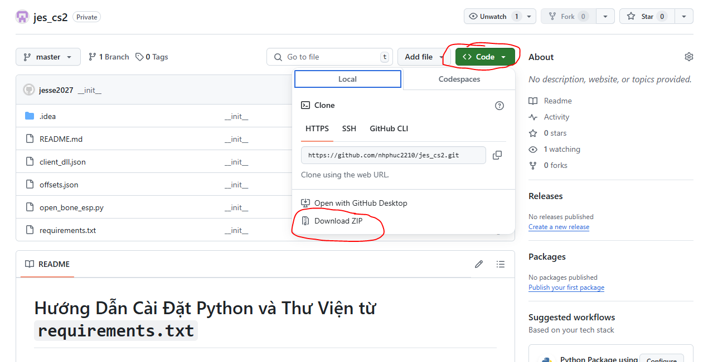
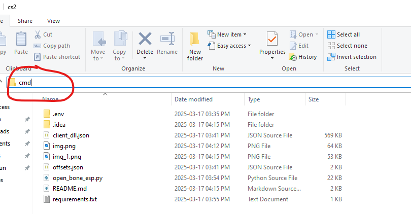
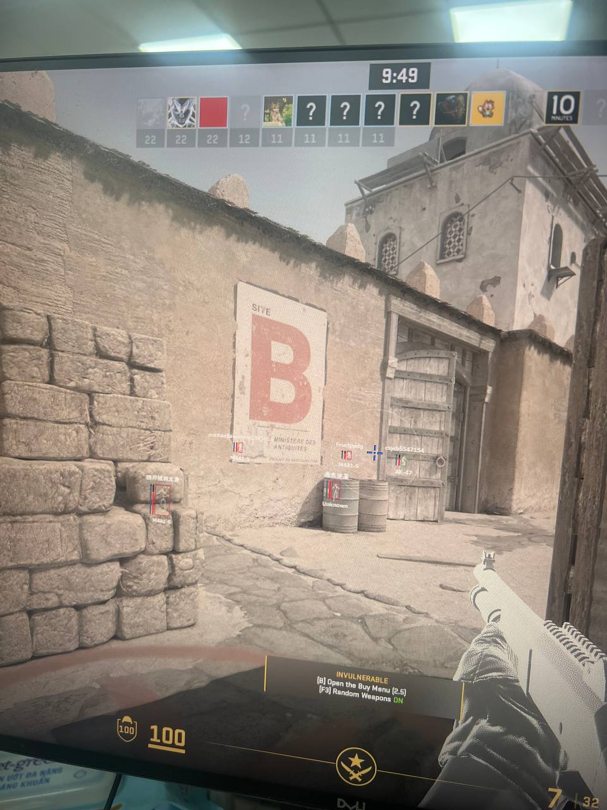

# Hướng Dẫn Cài Đặt và Khởi Chạy

## **Bước 1: Tải và Cài Đặt Python 3.10** (chỉ làm một lần đầu tiên)
### **Tải Python 3.10**
- Tải về và tiến hành cài đặt: https://www.python.org/ftp/python/3.10.0/python-3.10.0-amd64.exe

### **Cài đặt Python 3.10 trên Windows**
1. Chạy file cài đặt vừa tải về (`python-3.10.x.exe`).
2. **Chọn "Add Python to PATH"** trước khi nhấn **Install Now**.


## Bước 2: Tải Source Code từ GitHub và Giải Nén (chỉ làm một lần đầu tiên)

1. **Tải source code** từ GitHub

Link github: https://github.com/nhphuc2210/jes_cs2



## Bước 3: Mở CMD từ Thư Mục Vừa Tải Xuống (chỉ làm một lần đầu tiên)
Nhấp vào thanh địa chỉ của File Explorer (hoặc nhấn Ctrl + L).



Gõ cmd và nhấn Enter, sau đó chạy lệnh bên dưới để cài đặt.

```sh 
pip install -r requirements.txt
```


## Bước 4: Khởi chạy chương trình (Từ lần thứ 2 chỉ làm bước này)
Nhấp vào thanh địa chỉ của File Explorer (hoặc nhấn Ctrl + L).

Gõ cmd và nhấn Enter, sau đó chạy lệnh bên dưới để khởi chạy. 

Lưu ý:
1. Chạy trước hay sau khi mở game đều được. 
2. Chế độ game ở dạng: cửa sổ toàn màn hình
2. Chế độ game ở dạng: cửa sổ toàn màn hình
2. Chế độ game ở dạng: cửa sổ toàn màn hình

```sh 
python open_esp.py
```

## Bước 5: Giải trí sau một ngày làm việc mệt mõi


